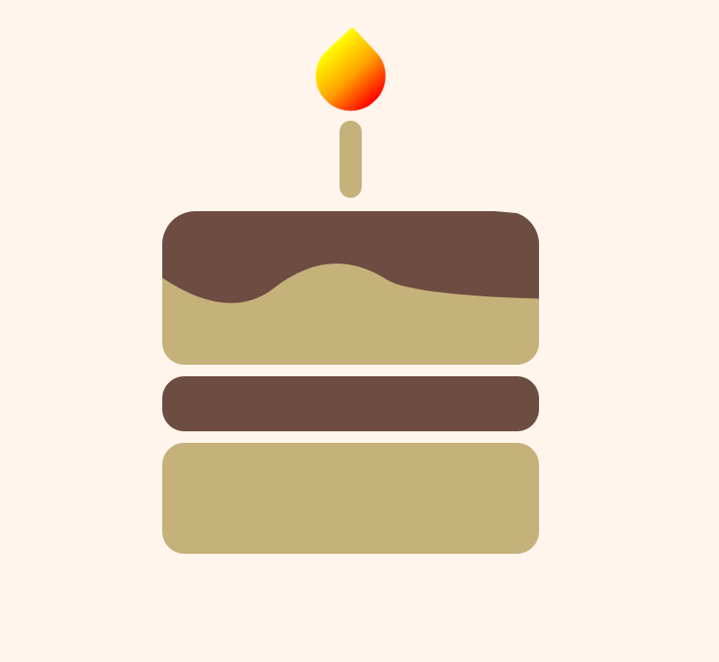

<h1 align=center > Projeto Bolo </h1>

### Bolo feito com HTML e CSS, site simples e muito divertido de se produzir. 😋

#

<a href="https://jamillyds.github.io/CAKE_WEB/">Link do projeto: Não é responsivo. 🎂</a>

#
